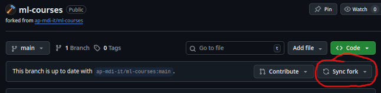

# Afspraken

## Leerstof
Begrippen en definities die in het **vet** staan moet je in je eigen woorden kunnen uitleggen op het examen.  
  
We besteden in de lessen veel aandacht aan wiskundige notatie. Het is de bedoeling dat je daarmee vertrouwd geraakt.
Op het examen krijg je een aantal oefeningen om éénvoudige formules te vertalen in Python code.  
  
De formules die gebruikt worden bij de uiteenzetting van begrippen en definities vormen _enkel leerstof indien ze expliciet voorkomen in de oefeningen_. Het is echter _sterk aangeraden_ om de wiskundige formules die daarbij horen te bestuderen en te begrijpen.  
  
De oefeningen vormen de basis voor de praktische eindproef.  
  
Externe links vormen _geen_ leerstof. Ze dienen enkel ter verdere verduidelijking en/of inspiratie.

:::{important}
Dit is een cursus in opbouw. Voor iedere les zal alles wat van toepassing is online staan in de repository.
Na de les is het mogelijk dat er bepaalde aanpassingen worden gemaakt om zaken te verduidelijken of aan te vullen waar nodig.
Die aanpassingen worden telkens aan het begin van elke les overlopen.
:::
  
:::{important}
Sync aan het begin van iedere les je geforkte repository

en zorg vervolgens dat je de changes ook lokaal hebt met `git pull` 
:::

:::{tip}
Neem notas tijdens de les!
:::

## Opdracht
In je opdracht ga je zelf een (mini-)tutorial uitwerken rond een bestaand machine-learning algoritme of onderdeel daarvan.
Je levert een (serie) notebook(s) af met daarin minimaal volgende secties:
- Inleiding
- Wiskundige uiteenzetting
- Uitgewerkt voorbeeld met een publieke/gesimuleerde dataset
  
Je geeft hierover een korte mondelinge presentatie tijdens de labo's van december. De presentatie wordt gevolgd door een korte vragensessie.
  
:::{important}
Je maakt eerst een keuze van een algoritme en toetst dit ten laatste in het labo van **3 oktober 2025** af met de titularis.
Daarna ga je zelfstandig aan de slag. Er is tijdens de labo's ruimte voor specifieke vragen of problemen.
Deadline voor het indienen van de opdracht: **1 december 2025**
:::

Alle verdere informatie/verduidelijking zal hier in de loop van het semester worden aangevuld.
